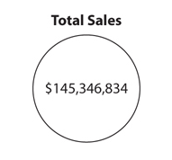
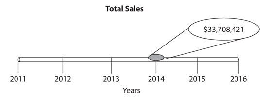
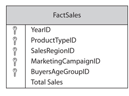

# Definition of Aggregate, Dimensions, Facts, and Slowly Changing Dimensions, and Description of Those in a Data Mart
Date: 25 February 2021

## Introduction
In this paper, I will describe about the definition of Aggregate, Dimensions, Facts, and Slowly Changing Dimensions, then also describe when those in a Data Mart. According to Larson's book, a data mart is a repository for data to be used as a source for business intelligence. The data mart is not used as part of day-to-day operations. (Larson, 2016) With my understanding, Aggregate, Dimensions, Facts, and Slowly Changing Dimensions are the elements in a Data Mart, those of concepts are used to identify the data type.

## Aggregate
An aggregate is a number that is calculated from amounts in many detail records. An aggregate is often the sum of many numbers, although it can also be derived using other arithmetic operations or even from a count of the number of items in a group. (Larson, 2016)

### Figure 1

(Larson, 2016)

In a Data Mart, the aggregating is defining to summery the same dimension data by querying the Data Mart.

 ## Dimensions

A dimension is a categorization used to spread out an aggregate measure to reveal its constituent parts. (Larson, 2016)

### Figure 2

(Larson, 2016)

In a Data Mart, a dimension percent as a table which is sorting the attributes as the additional information for the dimension.

## Facts

In addition to presenting the facts, the fact table includes surrogate keys that refer to each of the associated dimension tables. (Ward, 2020)

### Figure 3

(Larson, 2016)

In Data Mart, facts are store in the fact table which is also contain each dimension's foreign key.

## Slowly Changing Dimensions

A Slowly Changing Dimension (SCD) varies over time. Of course, the data in many dimensions can change over time. What differentiates an SCD is the fact that the history of that change is important and must be tracked in the business intelligence information. (Larson, 2016)

SCDs come in many varieties with the most common being Type 1, Type 2, and Type 3, as defined by the Business Intelligence community. (Larson, 2016) Different type of SCDs haves different focus we concerted as the list below:

-   Type 1 SCD:
    -   Don't keep track of its history as it changes
    -   The members of the dimension represent the way things are right now
    -   Impossible to go back and determine the state of the dimension members at any time in the past.
-   Type 2 SCD:
    -   A Type 2 SCD track the entire history of the dimension members
    -   Four supplementary attributes:
        -   SCD Original ID:
            -   As a unique identifier
        -   SCD Start Date
            -   The date this dimension member became active
        -   SCD End Date
            -   The date this dimension member ceased being active
        -   SCD Status
            -   The current state of this dimension member, either active or inactive
-   Type 3 SCD:
    -   Type 3 SCD tracks only the current state and the original state of a dimension member.
    -   Two supplementary attributes:
        -   SCD Start Date:
            -   The current state of this dimension member, either active or inactive
        -   SCD Initial Value
            -   The original state of this attribute

	In a Data Mart, the Slowly Changing Dimension (SCD) will be shown up in different dimensions when we due we different type of SCDs for querying, the type of SCDs could help us to transform the structure correctly.

## Conclusion
Aggregate, Dimensions, Facts, and Slowly Changing Dimensions, are the importance concept in the business intelligence, without those concepts the data are hardly to analyze it. After those study, I got the new ways to understand the data from the any business insight.

## REFERENCES

Larson, B. (2016, November 4). *Delivering Business Intelligence with Microsoft SQL Server 2016, Fourth Edition, 4th Edition*. *\[\[VitalSource Bookshelf version\]\].* Retrieved from vbk://9781259641497
WARD, S. U. S. A. N. (2020, October 4). *What Is Customer Relationship Management (CRM)?* https://www.thebalancesmb.com/crm-customer-relationship-management-2947184.

---
Copyright © 2021, [Jialin Li](https://github.com/keyskull).  