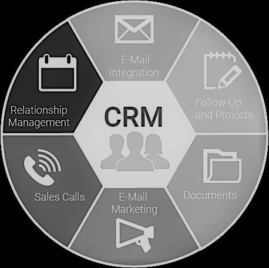

# Definition of Operational System, ETL, and Data Mart, and Description of the Process of Extracting, Transforming, and Loading Data from Multiple Operational System into a Data Mart

Date: 25 February 2021

## Introduction
This paper is discussing the Operational system, Extract, Transform, Load (ETL), and Data Mart with my understanding. Through my study with the course and various reading materials, I have basically knowledge about some terminologies in the field of business intelligence. According to Larson's book and the information from the internet, Data Mart is a source to support business intelligence; Operational System is a system for capturing many business processes details such as events or transactions day to day; Extract, Transform, Load (ETL) process is the controlled process as a flow for extracting data from one or more Online Transaction Processing (OLTP) system to Data Mart as needs.

## Data Mart
 A data mart is a body of historical data in an electronic repository that does not participate in the daily operations of the organization. Instead, this data is used to create business intelligence. The data in the data mart usually applies to a specific area of the organization. (Larson, 2016) With my understanding, the Data Mart is a fundamental concept in business intelligence, which is used to store historical data from one or more Online Transaction Processing (OLTP) systems. Via data consolidation and data cleansing to restructure the raw data from Online Transaction Processing (OLTP) system then store into Data Mart. Data Mart is like a constructed numerous data storage for business analysis with a business intelligence framework. According to Larson's book, the Data Mart is having those features below:

1.  Relational database;
2.  Speed access with numerous data;
3.  Not real-time data;
4.  Acceptable to have data repeated (denormalized) for the sake of speed

## Operational System
 An operational system directly supports the execution of a business process. By capturing details about significant events or transactions, it constructs a record of activities. (Ward, 2020) From my working experience, the Customer Relationship Management (CRM) system is one of the operational systems in business intelligence. The Customer Relationship Management (CRM) system is used to capture the customers' information such as customer name, customer contact information, and customer document, etc.

## Figure 1

## Extract, Transform, Load (ETL)
The extract, transform, and load (ETL) process extracts data from one or more OLTP systems, performs any required data cleansing to transform the data into a consistent format, and loads the cleansed data by inserting it into the data mart. (Larson, 2016) With my understanding, the extract, transform, load (ETL) process is the process to data before store data into the Data Mart. Data cleansing is a procedure of the extract, transform, and load (ETL) process.

## Extracting, Transforming, and Loading Data from Multiple Operational System into Data Mart

With a case in multiple operational system, the extract, transform, load (ETL) process will have done serval work below: 
1.  Take the raw data from each of the operational systems as we need;
2.  do data cleansing to transform the data to required format;
3.  Input cleansed data to data mart

## Conclusion
The study of business intelligence is having many compacted fundamental concepts. Operational System, extract, transform, and load (ETL), and Data Mart are the main concept of business intelligence, and those are the necessary programs and processes for business data. The field of business intelligence, it is having many professional terminologies I never learn before I take this class. For example, to my institution with operational system terminology, before I learn, I thought it is just talking about the computer system. 
	
## REFERENCES
Larson, B. (2016, November 4). *Delivering Business Intelligence with Microsoft SQL Server 2016, Fourth Edition, 4th Edition*. *\[\[VitalSource Bookshelf version\]\].* Retrieved from vbk://9781259641497

---
Copyright © 2021, [Jialin Li](https://github.com/keyskull).  