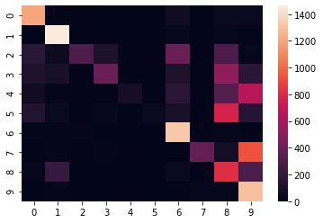

# Data Science Project: Handwritten Digit Recognition

## **1. Introduction**
---

### Participants:  Jialin Li(Cullen), Alexa Huang
---

### Data Science Project Steps:
1. Define the Research problem and questions
2. Analyze data by descriptive statistics and graphical visualization.
3.Prepare data by using relevant preprocessing transformations, data cleaning,data standardization,deaing with null and outlier values, feature engineering,feature importance and imbalanced data.
4. Divide data into test an training set.Evaluate variety of algorithms by creating test harness for diverse algorithms in conjuction with resampling techniques like cross validation bootstrapping.
5. Improve Result by playing with hyperparameters and innovative methods like ensembles.
6. Choose the best model and present the results.

### **1.1 Define the Research problem and questions**


#### Research Hypothesis:
* The project studies the classification for hand-written numbers to digital numbers. We assume that using we could recognize the digital labels from grayscale images.

#### Research Questions:
1. Can we classify handwritten numbers by image pixels?
2. Is there any correlation between each image pixels?
3. Is there any correlation between the frequency of grayscale pixels in each image?
4. Is there any correlation between the average grayscale pixels in each iamge?

### 1.2 Source of Datasets

https://www.kaggle.com/c/digit-recognizer/data

## **2. Analyze data by descriptive statistics and graphical visualization**
---

### 2.2 Preparing Data


```python
# import libraries
import numpy as np
import pandas as pd
import matplotlib
import matplotlib.pyplot as plt
from PIL import Image
from urllib.request import urlopen
import json
from random import randrange
import seaborn as sns
from sklearn.decomposition import PCA
```


```python
trainining_data = pd.read_csv('train.csv')
testing_data = pd.read_csv('test.csv')
trainining_data.shape , testing_data.shape
```


    ((6304, 785), (6890, 784))


### 2.3 Descriptive Statistics and Graphical Visualization
---

#### 2.3.1 Table Information:


```python
print("Dataset Analysis:")
print(trainining_data.shape)
print(trainining_data.info())
print(trainining_data.describe())
print(trainining_data.dtypes)
```

    Dataset Analysis:
    (42000, 785)
    <class 'pandas.core.frame.DataFrame'>
    RangeIndex: 42000 entries, 0 to 41999
    Columns: 785 entries, label to pixel783
    dtypes: int64(785)
    memory usage: 251.5 MB
    None
                  label   pixel0   pixel1  ...  pixel781  pixel782  pixel783
    count  42000.000000  42000.0  42000.0  ...   42000.0   42000.0   42000.0
    mean       4.456643      0.0      0.0  ...       0.0       0.0       0.0
    std        2.887730      0.0      0.0  ...       0.0       0.0       0.0
    min        0.000000      0.0      0.0  ...       0.0       0.0       0.0
    25%        2.000000      0.0      0.0  ...       0.0       0.0       0.0
    50%        4.000000      0.0      0.0  ...       0.0       0.0       0.0
    75%        7.000000      0.0      0.0  ...       0.0       0.0       0.0
    max        9.000000      0.0      0.0  ...       0.0       0.0       0.0
    
    [8 rows x 785 columns]
    label       int64
    pixel0      int64
    pixel1      int64
    pixel2      int64
    pixel3      int64
                ...  
    pixel779    int64
    pixel780    int64
    pixel781    int64
    pixel782    int64
    pixel783    int64
    Length: 785, dtype: object
    


```python
sample_image =trainining_data.sample(1)
print("sample image information:")
print('Label of the image:{}'.format(sample_image.label.values))
print('Shape of the image : {}'.format(sample_image.shape))
sample_pixels = pd.DataFrame(sample_image.drop(columns='label').values.reshape(28,28))
plt.imshow(sample_pixels,cmap='gray')
plt.show()
```

    sample image information:
    Label of the image:[6]
    Shape of the image : (1, 785)
    


#### 2.3.2 Evaluating Data

##### 2.3.2.1 Frequency Distribution
--- 


```python
# a) For the categorical variable create a frequency distribution.
# b) For the categorical variable create a bar diagram.
print('Digit Frequency:')
frequency = pd.DataFrame(trainining_data['label'].value_counts()).reset_index()
frequency = frequency.rename(columns={'label':'counts','index':'label'})
print(frequency)
sns.catplot(x='label',y='counts',kind="bar", data=frequency, height=5)
```

    Digit Frequency:
       label  counts
    0      1    4684
    1      7    4401
    2      3    4351
    3      9    4188
    4      2    4177
    5      6    4137
    6      0    4132
    7      4    4072
    8      8    4063
    9      5    3795
    


    <seaborn.axisgrid.FacetGrid at 0x7f0f70c1d2b0>


##### 2.3.2.2 Distribution plot
---


```python
# A Sample image's pixel distribution
print("A Sample image's pixel distribution:")
plt.hist(sample_image.values[0])
```

    A Sample image's pixel distribution:
    


    (array([675.,   8.,   4.,   8.,   1.,   2.,   4.,   5.,  12.,  66.]),
     array([  0. ,  25.5,  51. ,  76.5, 102. , 127.5, 153. , 178.5, 204. ,
            229.5, 255. ]),
     <a list of 10 Patch objects>)


```python
analysis_data = pd.DataFrame(data={'label':trainining_data['label'],
         'data':pd.DataFrame(PCA(1).fit_transform(trainining_data.drop(columns=['label'])))[0]})

print('The Numerical summaries grouped by names:')
print(analysis_data.groupby(['label']).mean())
print('Sample pixels distribution barplot with high ferquncy items:')

sns.boxplot(x='label',y='data',data= analysis_data)
```

    The Numerical summaries grouped by names:
                  data
    label             
    0      1008.488851
    1      -836.878797
    2       107.383155
    3        75.375515
    4       -80.126640
    5       108.060887
    6       196.715074
    7      -277.308078
    8         4.760889
    9      -171.960422
    Sample pixels distribution barplot with high ferquncy items:
    


    <matplotlib.axes._subplots.AxesSubplot at 0x7f4868147908>


### 2.4 Statistical Test

#### 2.4.1 Correlation Test


```python
from sklearn.model_selection import train_test_split
from sklearn import datasets, linear_model
from sklearn.metrics import mean_squared_error, r2_score

regr = linear_model.LinearRegression()
X = trainining_data.drop(columns=['label'])
y = X
X_train, X_test, y_train, y_test = train_test_split(X,y,test_size=0.33)
regr.fit(X_train,y_train)
y_pred = regr.predict(X_test)
print('Coefficients: \n', regr.coef_)
print('Mean squared error: %.2f'
      % mean_squared_error(y_test, y_pred))
print('Coefficient of determination: %.2f'
      % r2_score(y_test, y_pred))
```

    Mean squared error: 0.01
    Coefficient of determination: 0.88
    

##### 2.4.1.2 Correlation Matrix (Ansewer question 1: Is there any correlation between each image pixels?)

###### 2.4.1.2.1 Ansewer question 2: Is there any correlation between each image pixels?


```python
print('Correlation of graysacle pixels')
sns.heatmap(
    trainining_data.corr(),
    vmin=-1, vmax=1, center=0,
    cmap=sns.diverging_palette(20, 220, n=200),
    square=True
)
```

    Correlation of graysacle pixels
    


    <matplotlib.axes._subplots.AxesSubplot at 0x7f4854f07e48>


###### 2.4.1.2.2 Answer question 3: Is there any correlation between the frequency of grayscale pixels in each image?


```python
 print('Correlation of the frequncy of graysacle pixels in each image:')
 sns.heatmap(trainining_data.drop(columns=['label']).apply(lambda x: np.histogram(x.values)[0]).corr(),
    vmin=-1, vmax=1, center=0,
    cmap=sns.diverging_palette(20, 220, n=200),
    square=True
)
```

    Correlation of the frequncy of graysacle pixels in each image:
    


    <matplotlib.axes._subplots.AxesSubplot at 0x7f0f70d19198>


#### 2.4.2 T-test

#### 2.4.3 Chi Square Test

#### 2.4.4 ANOVA test

## **3. Prepare data by using relevant preprocessing transformations, data cleaning,data standardization,deaing with null and outlier values, feature engineering,feature importance and imbalanced data.**
---

### 3.1 Standardize Data


```python
#stratified sampling
analysis_data = trainining_data.copy()
analysis_data['total_pixels']= trainining_data.iloc[:,1:].apply(lambda x: x.values.sum(),axis=1)
analysis_data['average_grayscale'] = analysis_data['total_pixels'].apply(lambda x: x / 784)
analysis_data
```


<div>
<style scoped>
    .dataframe tbody tr th:only-of-type {
        vertical-align: middle;
    }

    .dataframe tbody tr th {
        vertical-align: top;
    }

    .dataframe thead th {
        text-align: right;
    }
</style>
<table border="1" class="dataframe">
  <thead>
    <tr style="text-align: right;">
      <th></th>
      <th>label</th>
      <th>pixel0</th>
      <th>pixel1</th>
      <th>pixel2</th>
      <th>pixel3</th>
      <th>pixel4</th>
      <th>pixel5</th>
      <th>pixel6</th>
      <th>pixel7</th>
      <th>pixel8</th>
      <th>pixel9</th>
      <th>pixel10</th>
      <th>pixel11</th>
      <th>pixel12</th>
      <th>pixel13</th>
      <th>pixel14</th>
      <th>pixel15</th>
      <th>pixel16</th>
      <th>pixel17</th>
      <th>pixel18</th>
      <th>pixel19</th>
      <th>pixel20</th>
      <th>pixel21</th>
      <th>pixel22</th>
      <th>pixel23</th>
      <th>pixel24</th>
      <th>pixel25</th>
      <th>pixel26</th>
      <th>pixel27</th>
      <th>pixel28</th>
      <th>pixel29</th>
      <th>pixel30</th>
      <th>pixel31</th>
      <th>pixel32</th>
      <th>pixel33</th>
      <th>pixel34</th>
      <th>pixel35</th>
      <th>pixel36</th>
      <th>pixel37</th>
      <th>pixel38</th>
      <th>...</th>
      <th>pixel746</th>
      <th>pixel747</th>
      <th>pixel748</th>
      <th>pixel749</th>
      <th>pixel750</th>
      <th>pixel751</th>
      <th>pixel752</th>
      <th>pixel753</th>
      <th>pixel754</th>
      <th>pixel755</th>
      <th>pixel756</th>
      <th>pixel757</th>
      <th>pixel758</th>
      <th>pixel759</th>
      <th>pixel760</th>
      <th>pixel761</th>
      <th>pixel762</th>
      <th>pixel763</th>
      <th>pixel764</th>
      <th>pixel765</th>
      <th>pixel766</th>
      <th>pixel767</th>
      <th>pixel768</th>
      <th>pixel769</th>
      <th>pixel770</th>
      <th>pixel771</th>
      <th>pixel772</th>
      <th>pixel773</th>
      <th>pixel774</th>
      <th>pixel775</th>
      <th>pixel776</th>
      <th>pixel777</th>
      <th>pixel778</th>
      <th>pixel779</th>
      <th>pixel780</th>
      <th>pixel781</th>
      <th>pixel782</th>
      <th>pixel783</th>
      <th>total_pixels</th>
      <th>average_grayscale</th>
    </tr>
  </thead>
  <tbody>
    <tr>
      <th>0</th>
      <td>1</td>
      <td>0</td>
      <td>0</td>
      <td>0</td>
      <td>0</td>
      <td>0</td>
      <td>0</td>
      <td>0</td>
      <td>0</td>
      <td>0</td>
      <td>0</td>
      <td>0</td>
      <td>0</td>
      <td>0</td>
      <td>0</td>
      <td>0</td>
      <td>0</td>
      <td>0</td>
      <td>0</td>
      <td>0</td>
      <td>0</td>
      <td>0</td>
      <td>0</td>
      <td>0</td>
      <td>0</td>
      <td>0</td>
      <td>0</td>
      <td>0</td>
      <td>0</td>
      <td>0</td>
      <td>0</td>
      <td>0</td>
      <td>0</td>
      <td>0</td>
      <td>0</td>
      <td>0</td>
      <td>0</td>
      <td>0</td>
      <td>0</td>
      <td>0</td>
      <td>...</td>
      <td>0</td>
      <td>0</td>
      <td>0</td>
      <td>0</td>
      <td>0</td>
      <td>0</td>
      <td>0</td>
      <td>0</td>
      <td>0</td>
      <td>0</td>
      <td>0</td>
      <td>0</td>
      <td>0</td>
      <td>0</td>
      <td>0</td>
      <td>0</td>
      <td>0</td>
      <td>0</td>
      <td>0</td>
      <td>0</td>
      <td>0</td>
      <td>0</td>
      <td>0</td>
      <td>0</td>
      <td>0</td>
      <td>0</td>
      <td>0</td>
      <td>0</td>
      <td>0</td>
      <td>0</td>
      <td>0</td>
      <td>0</td>
      <td>0</td>
      <td>0</td>
      <td>0</td>
      <td>0</td>
      <td>0</td>
      <td>0</td>
      <td>16649</td>
      <td>21.235969</td>
    </tr>
    <tr>
      <th>1</th>
      <td>0</td>
      <td>0</td>
      <td>0</td>
      <td>0</td>
      <td>0</td>
      <td>0</td>
      <td>0</td>
      <td>0</td>
      <td>0</td>
      <td>0</td>
      <td>0</td>
      <td>0</td>
      <td>0</td>
      <td>0</td>
      <td>0</td>
      <td>0</td>
      <td>0</td>
      <td>0</td>
      <td>0</td>
      <td>0</td>
      <td>0</td>
      <td>0</td>
      <td>0</td>
      <td>0</td>
      <td>0</td>
      <td>0</td>
      <td>0</td>
      <td>0</td>
      <td>0</td>
      <td>0</td>
      <td>0</td>
      <td>0</td>
      <td>0</td>
      <td>0</td>
      <td>0</td>
      <td>0</td>
      <td>0</td>
      <td>0</td>
      <td>0</td>
      <td>0</td>
      <td>...</td>
      <td>0</td>
      <td>0</td>
      <td>0</td>
      <td>0</td>
      <td>0</td>
      <td>0</td>
      <td>0</td>
      <td>0</td>
      <td>0</td>
      <td>0</td>
      <td>0</td>
      <td>0</td>
      <td>0</td>
      <td>0</td>
      <td>0</td>
      <td>0</td>
      <td>0</td>
      <td>0</td>
      <td>0</td>
      <td>0</td>
      <td>0</td>
      <td>0</td>
      <td>0</td>
      <td>0</td>
      <td>0</td>
      <td>0</td>
      <td>0</td>
      <td>0</td>
      <td>0</td>
      <td>0</td>
      <td>0</td>
      <td>0</td>
      <td>0</td>
      <td>0</td>
      <td>0</td>
      <td>0</td>
      <td>0</td>
      <td>0</td>
      <td>44609</td>
      <td>56.899235</td>
    </tr>
    <tr>
      <th>2</th>
      <td>1</td>
      <td>0</td>
      <td>0</td>
      <td>0</td>
      <td>0</td>
      <td>0</td>
      <td>0</td>
      <td>0</td>
      <td>0</td>
      <td>0</td>
      <td>0</td>
      <td>0</td>
      <td>0</td>
      <td>0</td>
      <td>0</td>
      <td>0</td>
      <td>0</td>
      <td>0</td>
      <td>0</td>
      <td>0</td>
      <td>0</td>
      <td>0</td>
      <td>0</td>
      <td>0</td>
      <td>0</td>
      <td>0</td>
      <td>0</td>
      <td>0</td>
      <td>0</td>
      <td>0</td>
      <td>0</td>
      <td>0</td>
      <td>0</td>
      <td>0</td>
      <td>0</td>
      <td>0</td>
      <td>0</td>
      <td>0</td>
      <td>0</td>
      <td>0</td>
      <td>...</td>
      <td>0</td>
      <td>0</td>
      <td>0</td>
      <td>0</td>
      <td>0</td>
      <td>0</td>
      <td>0</td>
      <td>0</td>
      <td>0</td>
      <td>0</td>
      <td>0</td>
      <td>0</td>
      <td>0</td>
      <td>0</td>
      <td>0</td>
      <td>0</td>
      <td>0</td>
      <td>0</td>
      <td>0</td>
      <td>0</td>
      <td>0</td>
      <td>0</td>
      <td>0</td>
      <td>0</td>
      <td>0</td>
      <td>0</td>
      <td>0</td>
      <td>0</td>
      <td>0</td>
      <td>0</td>
      <td>0</td>
      <td>0</td>
      <td>0</td>
      <td>0</td>
      <td>0</td>
      <td>0</td>
      <td>0</td>
      <td>0</td>
      <td>13425</td>
      <td>17.123724</td>
    </tr>
    <tr>
      <th>3</th>
      <td>4</td>
      <td>0</td>
      <td>0</td>
      <td>0</td>
      <td>0</td>
      <td>0</td>
      <td>0</td>
      <td>0</td>
      <td>0</td>
      <td>0</td>
      <td>0</td>
      <td>0</td>
      <td>0</td>
      <td>0</td>
      <td>0</td>
      <td>0</td>
      <td>0</td>
      <td>0</td>
      <td>0</td>
      <td>0</td>
      <td>0</td>
      <td>0</td>
      <td>0</td>
      <td>0</td>
      <td>0</td>
      <td>0</td>
      <td>0</td>
      <td>0</td>
      <td>0</td>
      <td>0</td>
      <td>0</td>
      <td>0</td>
      <td>0</td>
      <td>0</td>
      <td>0</td>
      <td>0</td>
      <td>0</td>
      <td>0</td>
      <td>0</td>
      <td>0</td>
      <td>...</td>
      <td>0</td>
      <td>0</td>
      <td>0</td>
      <td>0</td>
      <td>0</td>
      <td>0</td>
      <td>0</td>
      <td>0</td>
      <td>0</td>
      <td>0</td>
      <td>0</td>
      <td>0</td>
      <td>0</td>
      <td>0</td>
      <td>0</td>
      <td>0</td>
      <td>0</td>
      <td>0</td>
      <td>0</td>
      <td>0</td>
      <td>0</td>
      <td>0</td>
      <td>0</td>
      <td>0</td>
      <td>0</td>
      <td>0</td>
      <td>0</td>
      <td>0</td>
      <td>0</td>
      <td>0</td>
      <td>0</td>
      <td>0</td>
      <td>0</td>
      <td>0</td>
      <td>0</td>
      <td>0</td>
      <td>0</td>
      <td>0</td>
      <td>15025</td>
      <td>19.164541</td>
    </tr>
    <tr>
      <th>4</th>
      <td>0</td>
      <td>0</td>
      <td>0</td>
      <td>0</td>
      <td>0</td>
      <td>0</td>
      <td>0</td>
      <td>0</td>
      <td>0</td>
      <td>0</td>
      <td>0</td>
      <td>0</td>
      <td>0</td>
      <td>0</td>
      <td>0</td>
      <td>0</td>
      <td>0</td>
      <td>0</td>
      <td>0</td>
      <td>0</td>
      <td>0</td>
      <td>0</td>
      <td>0</td>
      <td>0</td>
      <td>0</td>
      <td>0</td>
      <td>0</td>
      <td>0</td>
      <td>0</td>
      <td>0</td>
      <td>0</td>
      <td>0</td>
      <td>0</td>
      <td>0</td>
      <td>0</td>
      <td>0</td>
      <td>0</td>
      <td>0</td>
      <td>0</td>
      <td>0</td>
      <td>...</td>
      <td>0</td>
      <td>0</td>
      <td>0</td>
      <td>0</td>
      <td>0</td>
      <td>0</td>
      <td>0</td>
      <td>0</td>
      <td>0</td>
      <td>0</td>
      <td>0</td>
      <td>0</td>
      <td>0</td>
      <td>0</td>
      <td>0</td>
      <td>0</td>
      <td>0</td>
      <td>0</td>
      <td>0</td>
      <td>0</td>
      <td>0</td>
      <td>0</td>
      <td>0</td>
      <td>0</td>
      <td>0</td>
      <td>0</td>
      <td>0</td>
      <td>0</td>
      <td>0</td>
      <td>0</td>
      <td>0</td>
      <td>0</td>
      <td>0</td>
      <td>0</td>
      <td>0</td>
      <td>0</td>
      <td>0</td>
      <td>0</td>
      <td>51093</td>
      <td>65.169643</td>
    </tr>
    <tr>
      <th>...</th>
      <td>...</td>
      <td>...</td>
      <td>...</td>
      <td>...</td>
      <td>...</td>
      <td>...</td>
      <td>...</td>
      <td>...</td>
      <td>...</td>
      <td>...</td>
      <td>...</td>
      <td>...</td>
      <td>...</td>
      <td>...</td>
      <td>...</td>
      <td>...</td>
      <td>...</td>
      <td>...</td>
      <td>...</td>
      <td>...</td>
      <td>...</td>
      <td>...</td>
      <td>...</td>
      <td>...</td>
      <td>...</td>
      <td>...</td>
      <td>...</td>
      <td>...</td>
      <td>...</td>
      <td>...</td>
      <td>...</td>
      <td>...</td>
      <td>...</td>
      <td>...</td>
      <td>...</td>
      <td>...</td>
      <td>...</td>
      <td>...</td>
      <td>...</td>
      <td>...</td>
      <td>...</td>
      <td>...</td>
      <td>...</td>
      <td>...</td>
      <td>...</td>
      <td>...</td>
      <td>...</td>
      <td>...</td>
      <td>...</td>
      <td>...</td>
      <td>...</td>
      <td>...</td>
      <td>...</td>
      <td>...</td>
      <td>...</td>
      <td>...</td>
      <td>...</td>
      <td>...</td>
      <td>...</td>
      <td>...</td>
      <td>...</td>
      <td>...</td>
      <td>...</td>
      <td>...</td>
      <td>...</td>
      <td>...</td>
      <td>...</td>
      <td>...</td>
      <td>...</td>
      <td>...</td>
      <td>...</td>
      <td>...</td>
      <td>...</td>
      <td>...</td>
      <td>...</td>
      <td>...</td>
      <td>...</td>
      <td>...</td>
      <td>...</td>
      <td>...</td>
      <td>...</td>
    </tr>
    <tr>
      <th>41995</th>
      <td>0</td>
      <td>0</td>
      <td>0</td>
      <td>0</td>
      <td>0</td>
      <td>0</td>
      <td>0</td>
      <td>0</td>
      <td>0</td>
      <td>0</td>
      <td>0</td>
      <td>0</td>
      <td>0</td>
      <td>0</td>
      <td>0</td>
      <td>0</td>
      <td>0</td>
      <td>0</td>
      <td>0</td>
      <td>0</td>
      <td>0</td>
      <td>0</td>
      <td>0</td>
      <td>0</td>
      <td>0</td>
      <td>0</td>
      <td>0</td>
      <td>0</td>
      <td>0</td>
      <td>0</td>
      <td>0</td>
      <td>0</td>
      <td>0</td>
      <td>0</td>
      <td>0</td>
      <td>0</td>
      <td>0</td>
      <td>0</td>
      <td>0</td>
      <td>0</td>
      <td>...</td>
      <td>0</td>
      <td>0</td>
      <td>0</td>
      <td>0</td>
      <td>0</td>
      <td>0</td>
      <td>0</td>
      <td>0</td>
      <td>0</td>
      <td>0</td>
      <td>0</td>
      <td>0</td>
      <td>0</td>
      <td>0</td>
      <td>0</td>
      <td>0</td>
      <td>0</td>
      <td>0</td>
      <td>0</td>
      <td>0</td>
      <td>0</td>
      <td>0</td>
      <td>0</td>
      <td>0</td>
      <td>0</td>
      <td>0</td>
      <td>0</td>
      <td>0</td>
      <td>0</td>
      <td>0</td>
      <td>0</td>
      <td>0</td>
      <td>0</td>
      <td>0</td>
      <td>0</td>
      <td>0</td>
      <td>0</td>
      <td>0</td>
      <td>29310</td>
      <td>37.385204</td>
    </tr>
    <tr>
      <th>41996</th>
      <td>1</td>
      <td>0</td>
      <td>0</td>
      <td>0</td>
      <td>0</td>
      <td>0</td>
      <td>0</td>
      <td>0</td>
      <td>0</td>
      <td>0</td>
      <td>0</td>
      <td>0</td>
      <td>0</td>
      <td>0</td>
      <td>0</td>
      <td>0</td>
      <td>0</td>
      <td>0</td>
      <td>0</td>
      <td>0</td>
      <td>0</td>
      <td>0</td>
      <td>0</td>
      <td>0</td>
      <td>0</td>
      <td>0</td>
      <td>0</td>
      <td>0</td>
      <td>0</td>
      <td>0</td>
      <td>0</td>
      <td>0</td>
      <td>0</td>
      <td>0</td>
      <td>0</td>
      <td>0</td>
      <td>0</td>
      <td>0</td>
      <td>0</td>
      <td>0</td>
      <td>...</td>
      <td>0</td>
      <td>0</td>
      <td>0</td>
      <td>0</td>
      <td>0</td>
      <td>0</td>
      <td>0</td>
      <td>0</td>
      <td>0</td>
      <td>0</td>
      <td>0</td>
      <td>0</td>
      <td>0</td>
      <td>0</td>
      <td>0</td>
      <td>0</td>
      <td>0</td>
      <td>0</td>
      <td>0</td>
      <td>0</td>
      <td>0</td>
      <td>0</td>
      <td>0</td>
      <td>0</td>
      <td>0</td>
      <td>0</td>
      <td>0</td>
      <td>0</td>
      <td>0</td>
      <td>0</td>
      <td>0</td>
      <td>0</td>
      <td>0</td>
      <td>0</td>
      <td>0</td>
      <td>0</td>
      <td>0</td>
      <td>0</td>
      <td>13415</td>
      <td>17.110969</td>
    </tr>
    <tr>
      <th>41997</th>
      <td>7</td>
      <td>0</td>
      <td>0</td>
      <td>0</td>
      <td>0</td>
      <td>0</td>
      <td>0</td>
      <td>0</td>
      <td>0</td>
      <td>0</td>
      <td>0</td>
      <td>0</td>
      <td>0</td>
      <td>0</td>
      <td>0</td>
      <td>0</td>
      <td>0</td>
      <td>0</td>
      <td>0</td>
      <td>0</td>
      <td>0</td>
      <td>0</td>
      <td>0</td>
      <td>0</td>
      <td>0</td>
      <td>0</td>
      <td>0</td>
      <td>0</td>
      <td>0</td>
      <td>0</td>
      <td>0</td>
      <td>0</td>
      <td>0</td>
      <td>0</td>
      <td>0</td>
      <td>0</td>
      <td>0</td>
      <td>0</td>
      <td>0</td>
      <td>0</td>
      <td>...</td>
      <td>0</td>
      <td>0</td>
      <td>0</td>
      <td>0</td>
      <td>0</td>
      <td>0</td>
      <td>0</td>
      <td>0</td>
      <td>0</td>
      <td>0</td>
      <td>0</td>
      <td>0</td>
      <td>0</td>
      <td>0</td>
      <td>0</td>
      <td>0</td>
      <td>0</td>
      <td>0</td>
      <td>0</td>
      <td>0</td>
      <td>0</td>
      <td>0</td>
      <td>0</td>
      <td>0</td>
      <td>0</td>
      <td>0</td>
      <td>0</td>
      <td>0</td>
      <td>0</td>
      <td>0</td>
      <td>0</td>
      <td>0</td>
      <td>0</td>
      <td>0</td>
      <td>0</td>
      <td>0</td>
      <td>0</td>
      <td>0</td>
      <td>31504</td>
      <td>40.183673</td>
    </tr>
    <tr>
      <th>41998</th>
      <td>6</td>
      <td>0</td>
      <td>0</td>
      <td>0</td>
      <td>0</td>
      <td>0</td>
      <td>0</td>
      <td>0</td>
      <td>0</td>
      <td>0</td>
      <td>0</td>
      <td>0</td>
      <td>0</td>
      <td>0</td>
      <td>0</td>
      <td>0</td>
      <td>0</td>
      <td>0</td>
      <td>0</td>
      <td>0</td>
      <td>0</td>
      <td>0</td>
      <td>0</td>
      <td>0</td>
      <td>0</td>
      <td>0</td>
      <td>0</td>
      <td>0</td>
      <td>0</td>
      <td>0</td>
      <td>0</td>
      <td>0</td>
      <td>0</td>
      <td>0</td>
      <td>0</td>
      <td>0</td>
      <td>0</td>
      <td>0</td>
      <td>0</td>
      <td>0</td>
      <td>...</td>
      <td>0</td>
      <td>0</td>
      <td>0</td>
      <td>0</td>
      <td>0</td>
      <td>0</td>
      <td>0</td>
      <td>0</td>
      <td>0</td>
      <td>0</td>
      <td>0</td>
      <td>0</td>
      <td>0</td>
      <td>0</td>
      <td>0</td>
      <td>0</td>
      <td>0</td>
      <td>0</td>
      <td>0</td>
      <td>0</td>
      <td>0</td>
      <td>0</td>
      <td>0</td>
      <td>0</td>
      <td>0</td>
      <td>0</td>
      <td>0</td>
      <td>0</td>
      <td>0</td>
      <td>0</td>
      <td>0</td>
      <td>0</td>
      <td>0</td>
      <td>0</td>
      <td>0</td>
      <td>0</td>
      <td>0</td>
      <td>0</td>
      <td>26381</td>
      <td>33.649235</td>
    </tr>
    <tr>
      <th>41999</th>
      <td>9</td>
      <td>0</td>
      <td>0</td>
      <td>0</td>
      <td>0</td>
      <td>0</td>
      <td>0</td>
      <td>0</td>
      <td>0</td>
      <td>0</td>
      <td>0</td>
      <td>0</td>
      <td>0</td>
      <td>0</td>
      <td>0</td>
      <td>0</td>
      <td>0</td>
      <td>0</td>
      <td>0</td>
      <td>0</td>
      <td>0</td>
      <td>0</td>
      <td>0</td>
      <td>0</td>
      <td>0</td>
      <td>0</td>
      <td>0</td>
      <td>0</td>
      <td>0</td>
      <td>0</td>
      <td>0</td>
      <td>0</td>
      <td>0</td>
      <td>0</td>
      <td>0</td>
      <td>0</td>
      <td>0</td>
      <td>0</td>
      <td>0</td>
      <td>0</td>
      <td>...</td>
      <td>0</td>
      <td>0</td>
      <td>0</td>
      <td>0</td>
      <td>0</td>
      <td>0</td>
      <td>0</td>
      <td>0</td>
      <td>0</td>
      <td>0</td>
      <td>0</td>
      <td>0</td>
      <td>0</td>
      <td>0</td>
      <td>0</td>
      <td>0</td>
      <td>0</td>
      <td>0</td>
      <td>0</td>
      <td>0</td>
      <td>0</td>
      <td>0</td>
      <td>0</td>
      <td>0</td>
      <td>0</td>
      <td>0</td>
      <td>0</td>
      <td>0</td>
      <td>0</td>
      <td>0</td>
      <td>0</td>
      <td>0</td>
      <td>0</td>
      <td>0</td>
      <td>0</td>
      <td>0</td>
      <td>0</td>
      <td>0</td>
      <td>18178</td>
      <td>23.186224</td>
    </tr>
  </tbody>
</table>
<p>42000 rows × 787 columns</p>
</div>


### 3.2 Null Values Checking
---


```python
empty_data = trainining_data[trainining_data.isna().any(axis=1)]
print(empty_data)
trainining_data = trainining_data.drop(empty_data.index)
trainining_data
```

          label  pixel0  pixel1  pixel2  ...  pixel780  pixel781  pixel782  pixel783
    6303      2       0       0       0  ...       NaN       NaN       NaN       NaN
    
    [1 rows x 785 columns]
    


<div>
<style scoped>
    .dataframe tbody tr th:only-of-type {
        vertical-align: middle;
    }

    .dataframe tbody tr th {
        vertical-align: top;
    }

    .dataframe thead th {
        text-align: right;
    }
</style>
<table border="1" class="dataframe">
  <thead>
    <tr style="text-align: right;">
      <th></th>
      <th>label</th>
      <th>pixel0</th>
      <th>pixel1</th>
      <th>pixel2</th>
      <th>pixel3</th>
      <th>pixel4</th>
      <th>pixel5</th>
      <th>pixel6</th>
      <th>pixel7</th>
      <th>pixel8</th>
      <th>pixel9</th>
      <th>pixel10</th>
      <th>pixel11</th>
      <th>pixel12</th>
      <th>pixel13</th>
      <th>pixel14</th>
      <th>pixel15</th>
      <th>pixel16</th>
      <th>pixel17</th>
      <th>pixel18</th>
      <th>pixel19</th>
      <th>pixel20</th>
      <th>pixel21</th>
      <th>pixel22</th>
      <th>pixel23</th>
      <th>pixel24</th>
      <th>pixel25</th>
      <th>pixel26</th>
      <th>pixel27</th>
      <th>pixel28</th>
      <th>pixel29</th>
      <th>pixel30</th>
      <th>pixel31</th>
      <th>pixel32</th>
      <th>pixel33</th>
      <th>pixel34</th>
      <th>pixel35</th>
      <th>pixel36</th>
      <th>pixel37</th>
      <th>pixel38</th>
      <th>...</th>
      <th>pixel744</th>
      <th>pixel745</th>
      <th>pixel746</th>
      <th>pixel747</th>
      <th>pixel748</th>
      <th>pixel749</th>
      <th>pixel750</th>
      <th>pixel751</th>
      <th>pixel752</th>
      <th>pixel753</th>
      <th>pixel754</th>
      <th>pixel755</th>
      <th>pixel756</th>
      <th>pixel757</th>
      <th>pixel758</th>
      <th>pixel759</th>
      <th>pixel760</th>
      <th>pixel761</th>
      <th>pixel762</th>
      <th>pixel763</th>
      <th>pixel764</th>
      <th>pixel765</th>
      <th>pixel766</th>
      <th>pixel767</th>
      <th>pixel768</th>
      <th>pixel769</th>
      <th>pixel770</th>
      <th>pixel771</th>
      <th>pixel772</th>
      <th>pixel773</th>
      <th>pixel774</th>
      <th>pixel775</th>
      <th>pixel776</th>
      <th>pixel777</th>
      <th>pixel778</th>
      <th>pixel779</th>
      <th>pixel780</th>
      <th>pixel781</th>
      <th>pixel782</th>
      <th>pixel783</th>
    </tr>
  </thead>
  <tbody>
    <tr>
      <th>0</th>
      <td>1</td>
      <td>0</td>
      <td>0</td>
      <td>0</td>
      <td>0</td>
      <td>0</td>
      <td>0</td>
      <td>0</td>
      <td>0</td>
      <td>0</td>
      <td>0</td>
      <td>0</td>
      <td>0</td>
      <td>0</td>
      <td>0</td>
      <td>0</td>
      <td>0</td>
      <td>0</td>
      <td>0</td>
      <td>0</td>
      <td>0</td>
      <td>0</td>
      <td>0</td>
      <td>0</td>
      <td>0</td>
      <td>0</td>
      <td>0</td>
      <td>0</td>
      <td>0</td>
      <td>0</td>
      <td>0</td>
      <td>0</td>
      <td>0</td>
      <td>0</td>
      <td>0</td>
      <td>0</td>
      <td>0</td>
      <td>0</td>
      <td>0</td>
      <td>0</td>
      <td>...</td>
      <td>0.0</td>
      <td>0.0</td>
      <td>0.0</td>
      <td>0.0</td>
      <td>0.0</td>
      <td>0.0</td>
      <td>0.0</td>
      <td>0.0</td>
      <td>0.0</td>
      <td>0.0</td>
      <td>0.0</td>
      <td>0.0</td>
      <td>0.0</td>
      <td>0.0</td>
      <td>0.0</td>
      <td>0.0</td>
      <td>0.0</td>
      <td>0.0</td>
      <td>0.0</td>
      <td>0.0</td>
      <td>0.0</td>
      <td>0.0</td>
      <td>0.0</td>
      <td>0.0</td>
      <td>0.0</td>
      <td>0.0</td>
      <td>0.0</td>
      <td>0.0</td>
      <td>0.0</td>
      <td>0.0</td>
      <td>0.0</td>
      <td>0.0</td>
      <td>0.0</td>
      <td>0.0</td>
      <td>0.0</td>
      <td>0.0</td>
      <td>0.0</td>
      <td>0.0</td>
      <td>0.0</td>
      <td>0.0</td>
    </tr>
    <tr>
      <th>1</th>
      <td>0</td>
      <td>0</td>
      <td>0</td>
      <td>0</td>
      <td>0</td>
      <td>0</td>
      <td>0</td>
      <td>0</td>
      <td>0</td>
      <td>0</td>
      <td>0</td>
      <td>0</td>
      <td>0</td>
      <td>0</td>
      <td>0</td>
      <td>0</td>
      <td>0</td>
      <td>0</td>
      <td>0</td>
      <td>0</td>
      <td>0</td>
      <td>0</td>
      <td>0</td>
      <td>0</td>
      <td>0</td>
      <td>0</td>
      <td>0</td>
      <td>0</td>
      <td>0</td>
      <td>0</td>
      <td>0</td>
      <td>0</td>
      <td>0</td>
      <td>0</td>
      <td>0</td>
      <td>0</td>
      <td>0</td>
      <td>0</td>
      <td>0</td>
      <td>0</td>
      <td>...</td>
      <td>0.0</td>
      <td>0.0</td>
      <td>0.0</td>
      <td>0.0</td>
      <td>0.0</td>
      <td>0.0</td>
      <td>0.0</td>
      <td>0.0</td>
      <td>0.0</td>
      <td>0.0</td>
      <td>0.0</td>
      <td>0.0</td>
      <td>0.0</td>
      <td>0.0</td>
      <td>0.0</td>
      <td>0.0</td>
      <td>0.0</td>
      <td>0.0</td>
      <td>0.0</td>
      <td>0.0</td>
      <td>0.0</td>
      <td>0.0</td>
      <td>0.0</td>
      <td>0.0</td>
      <td>0.0</td>
      <td>0.0</td>
      <td>0.0</td>
      <td>0.0</td>
      <td>0.0</td>
      <td>0.0</td>
      <td>0.0</td>
      <td>0.0</td>
      <td>0.0</td>
      <td>0.0</td>
      <td>0.0</td>
      <td>0.0</td>
      <td>0.0</td>
      <td>0.0</td>
      <td>0.0</td>
      <td>0.0</td>
    </tr>
    <tr>
      <th>2</th>
      <td>1</td>
      <td>0</td>
      <td>0</td>
      <td>0</td>
      <td>0</td>
      <td>0</td>
      <td>0</td>
      <td>0</td>
      <td>0</td>
      <td>0</td>
      <td>0</td>
      <td>0</td>
      <td>0</td>
      <td>0</td>
      <td>0</td>
      <td>0</td>
      <td>0</td>
      <td>0</td>
      <td>0</td>
      <td>0</td>
      <td>0</td>
      <td>0</td>
      <td>0</td>
      <td>0</td>
      <td>0</td>
      <td>0</td>
      <td>0</td>
      <td>0</td>
      <td>0</td>
      <td>0</td>
      <td>0</td>
      <td>0</td>
      <td>0</td>
      <td>0</td>
      <td>0</td>
      <td>0</td>
      <td>0</td>
      <td>0</td>
      <td>0</td>
      <td>0</td>
      <td>...</td>
      <td>0.0</td>
      <td>0.0</td>
      <td>0.0</td>
      <td>0.0</td>
      <td>0.0</td>
      <td>0.0</td>
      <td>0.0</td>
      <td>0.0</td>
      <td>0.0</td>
      <td>0.0</td>
      <td>0.0</td>
      <td>0.0</td>
      <td>0.0</td>
      <td>0.0</td>
      <td>0.0</td>
      <td>0.0</td>
      <td>0.0</td>
      <td>0.0</td>
      <td>0.0</td>
      <td>0.0</td>
      <td>0.0</td>
      <td>0.0</td>
      <td>0.0</td>
      <td>0.0</td>
      <td>0.0</td>
      <td>0.0</td>
      <td>0.0</td>
      <td>0.0</td>
      <td>0.0</td>
      <td>0.0</td>
      <td>0.0</td>
      <td>0.0</td>
      <td>0.0</td>
      <td>0.0</td>
      <td>0.0</td>
      <td>0.0</td>
      <td>0.0</td>
      <td>0.0</td>
      <td>0.0</td>
      <td>0.0</td>
    </tr>
    <tr>
      <th>3</th>
      <td>4</td>
      <td>0</td>
      <td>0</td>
      <td>0</td>
      <td>0</td>
      <td>0</td>
      <td>0</td>
      <td>0</td>
      <td>0</td>
      <td>0</td>
      <td>0</td>
      <td>0</td>
      <td>0</td>
      <td>0</td>
      <td>0</td>
      <td>0</td>
      <td>0</td>
      <td>0</td>
      <td>0</td>
      <td>0</td>
      <td>0</td>
      <td>0</td>
      <td>0</td>
      <td>0</td>
      <td>0</td>
      <td>0</td>
      <td>0</td>
      <td>0</td>
      <td>0</td>
      <td>0</td>
      <td>0</td>
      <td>0</td>
      <td>0</td>
      <td>0</td>
      <td>0</td>
      <td>0</td>
      <td>0</td>
      <td>0</td>
      <td>0</td>
      <td>0</td>
      <td>...</td>
      <td>0.0</td>
      <td>0.0</td>
      <td>0.0</td>
      <td>0.0</td>
      <td>0.0</td>
      <td>0.0</td>
      <td>0.0</td>
      <td>0.0</td>
      <td>0.0</td>
      <td>0.0</td>
      <td>0.0</td>
      <td>0.0</td>
      <td>0.0</td>
      <td>0.0</td>
      <td>0.0</td>
      <td>0.0</td>
      <td>0.0</td>
      <td>0.0</td>
      <td>0.0</td>
      <td>0.0</td>
      <td>0.0</td>
      <td>0.0</td>
      <td>0.0</td>
      <td>0.0</td>
      <td>0.0</td>
      <td>0.0</td>
      <td>0.0</td>
      <td>0.0</td>
      <td>0.0</td>
      <td>0.0</td>
      <td>0.0</td>
      <td>0.0</td>
      <td>0.0</td>
      <td>0.0</td>
      <td>0.0</td>
      <td>0.0</td>
      <td>0.0</td>
      <td>0.0</td>
      <td>0.0</td>
      <td>0.0</td>
    </tr>
    <tr>
      <th>4</th>
      <td>0</td>
      <td>0</td>
      <td>0</td>
      <td>0</td>
      <td>0</td>
      <td>0</td>
      <td>0</td>
      <td>0</td>
      <td>0</td>
      <td>0</td>
      <td>0</td>
      <td>0</td>
      <td>0</td>
      <td>0</td>
      <td>0</td>
      <td>0</td>
      <td>0</td>
      <td>0</td>
      <td>0</td>
      <td>0</td>
      <td>0</td>
      <td>0</td>
      <td>0</td>
      <td>0</td>
      <td>0</td>
      <td>0</td>
      <td>0</td>
      <td>0</td>
      <td>0</td>
      <td>0</td>
      <td>0</td>
      <td>0</td>
      <td>0</td>
      <td>0</td>
      <td>0</td>
      <td>0</td>
      <td>0</td>
      <td>0</td>
      <td>0</td>
      <td>0</td>
      <td>...</td>
      <td>0.0</td>
      <td>0.0</td>
      <td>0.0</td>
      <td>0.0</td>
      <td>0.0</td>
      <td>0.0</td>
      <td>0.0</td>
      <td>0.0</td>
      <td>0.0</td>
      <td>0.0</td>
      <td>0.0</td>
      <td>0.0</td>
      <td>0.0</td>
      <td>0.0</td>
      <td>0.0</td>
      <td>0.0</td>
      <td>0.0</td>
      <td>0.0</td>
      <td>0.0</td>
      <td>0.0</td>
      <td>0.0</td>
      <td>0.0</td>
      <td>0.0</td>
      <td>0.0</td>
      <td>0.0</td>
      <td>0.0</td>
      <td>0.0</td>
      <td>0.0</td>
      <td>0.0</td>
      <td>0.0</td>
      <td>0.0</td>
      <td>0.0</td>
      <td>0.0</td>
      <td>0.0</td>
      <td>0.0</td>
      <td>0.0</td>
      <td>0.0</td>
      <td>0.0</td>
      <td>0.0</td>
      <td>0.0</td>
    </tr>
    <tr>
      <th>...</th>
      <td>...</td>
      <td>...</td>
      <td>...</td>
      <td>...</td>
      <td>...</td>
      <td>...</td>
      <td>...</td>
      <td>...</td>
      <td>...</td>
      <td>...</td>
      <td>...</td>
      <td>...</td>
      <td>...</td>
      <td>...</td>
      <td>...</td>
      <td>...</td>
      <td>...</td>
      <td>...</td>
      <td>...</td>
      <td>...</td>
      <td>...</td>
      <td>...</td>
      <td>...</td>
      <td>...</td>
      <td>...</td>
      <td>...</td>
      <td>...</td>
      <td>...</td>
      <td>...</td>
      <td>...</td>
      <td>...</td>
      <td>...</td>
      <td>...</td>
      <td>...</td>
      <td>...</td>
      <td>...</td>
      <td>...</td>
      <td>...</td>
      <td>...</td>
      <td>...</td>
      <td>...</td>
      <td>...</td>
      <td>...</td>
      <td>...</td>
      <td>...</td>
      <td>...</td>
      <td>...</td>
      <td>...</td>
      <td>...</td>
      <td>...</td>
      <td>...</td>
      <td>...</td>
      <td>...</td>
      <td>...</td>
      <td>...</td>
      <td>...</td>
      <td>...</td>
      <td>...</td>
      <td>...</td>
      <td>...</td>
      <td>...</td>
      <td>...</td>
      <td>...</td>
      <td>...</td>
      <td>...</td>
      <td>...</td>
      <td>...</td>
      <td>...</td>
      <td>...</td>
      <td>...</td>
      <td>...</td>
      <td>...</td>
      <td>...</td>
      <td>...</td>
      <td>...</td>
      <td>...</td>
      <td>...</td>
      <td>...</td>
      <td>...</td>
      <td>...</td>
      <td>...</td>
    </tr>
    <tr>
      <th>6298</th>
      <td>9</td>
      <td>0</td>
      <td>0</td>
      <td>0</td>
      <td>0</td>
      <td>0</td>
      <td>0</td>
      <td>0</td>
      <td>0</td>
      <td>0</td>
      <td>0</td>
      <td>0</td>
      <td>0</td>
      <td>0</td>
      <td>0</td>
      <td>0</td>
      <td>0</td>
      <td>0</td>
      <td>0</td>
      <td>0</td>
      <td>0</td>
      <td>0</td>
      <td>0</td>
      <td>0</td>
      <td>0</td>
      <td>0</td>
      <td>0</td>
      <td>0</td>
      <td>0</td>
      <td>0</td>
      <td>0</td>
      <td>0</td>
      <td>0</td>
      <td>0</td>
      <td>0</td>
      <td>0</td>
      <td>0</td>
      <td>0</td>
      <td>0</td>
      <td>0</td>
      <td>...</td>
      <td>0.0</td>
      <td>0.0</td>
      <td>0.0</td>
      <td>0.0</td>
      <td>0.0</td>
      <td>0.0</td>
      <td>0.0</td>
      <td>0.0</td>
      <td>0.0</td>
      <td>0.0</td>
      <td>0.0</td>
      <td>0.0</td>
      <td>0.0</td>
      <td>0.0</td>
      <td>0.0</td>
      <td>0.0</td>
      <td>0.0</td>
      <td>0.0</td>
      <td>0.0</td>
      <td>0.0</td>
      <td>0.0</td>
      <td>0.0</td>
      <td>0.0</td>
      <td>0.0</td>
      <td>0.0</td>
      <td>0.0</td>
      <td>0.0</td>
      <td>0.0</td>
      <td>0.0</td>
      <td>0.0</td>
      <td>0.0</td>
      <td>0.0</td>
      <td>0.0</td>
      <td>0.0</td>
      <td>0.0</td>
      <td>0.0</td>
      <td>0.0</td>
      <td>0.0</td>
      <td>0.0</td>
      <td>0.0</td>
    </tr>
    <tr>
      <th>6299</th>
      <td>9</td>
      <td>0</td>
      <td>0</td>
      <td>0</td>
      <td>0</td>
      <td>0</td>
      <td>0</td>
      <td>0</td>
      <td>0</td>
      <td>0</td>
      <td>0</td>
      <td>0</td>
      <td>0</td>
      <td>0</td>
      <td>0</td>
      <td>0</td>
      <td>0</td>
      <td>0</td>
      <td>0</td>
      <td>0</td>
      <td>0</td>
      <td>0</td>
      <td>0</td>
      <td>0</td>
      <td>0</td>
      <td>0</td>
      <td>0</td>
      <td>0</td>
      <td>0</td>
      <td>0</td>
      <td>0</td>
      <td>0</td>
      <td>0</td>
      <td>0</td>
      <td>0</td>
      <td>0</td>
      <td>0</td>
      <td>0</td>
      <td>0</td>
      <td>0</td>
      <td>...</td>
      <td>0.0</td>
      <td>0.0</td>
      <td>0.0</td>
      <td>0.0</td>
      <td>0.0</td>
      <td>0.0</td>
      <td>0.0</td>
      <td>0.0</td>
      <td>0.0</td>
      <td>0.0</td>
      <td>0.0</td>
      <td>0.0</td>
      <td>0.0</td>
      <td>0.0</td>
      <td>0.0</td>
      <td>0.0</td>
      <td>0.0</td>
      <td>0.0</td>
      <td>0.0</td>
      <td>0.0</td>
      <td>0.0</td>
      <td>0.0</td>
      <td>0.0</td>
      <td>0.0</td>
      <td>0.0</td>
      <td>0.0</td>
      <td>0.0</td>
      <td>0.0</td>
      <td>0.0</td>
      <td>0.0</td>
      <td>0.0</td>
      <td>0.0</td>
      <td>0.0</td>
      <td>0.0</td>
      <td>0.0</td>
      <td>0.0</td>
      <td>0.0</td>
      <td>0.0</td>
      <td>0.0</td>
      <td>0.0</td>
    </tr>
    <tr>
      <th>6300</th>
      <td>8</td>
      <td>0</td>
      <td>0</td>
      <td>0</td>
      <td>0</td>
      <td>0</td>
      <td>0</td>
      <td>0</td>
      <td>0</td>
      <td>0</td>
      <td>0</td>
      <td>0</td>
      <td>0</td>
      <td>0</td>
      <td>0</td>
      <td>0</td>
      <td>0</td>
      <td>0</td>
      <td>0</td>
      <td>0</td>
      <td>0</td>
      <td>0</td>
      <td>0</td>
      <td>0</td>
      <td>0</td>
      <td>0</td>
      <td>0</td>
      <td>0</td>
      <td>0</td>
      <td>0</td>
      <td>0</td>
      <td>0</td>
      <td>0</td>
      <td>0</td>
      <td>0</td>
      <td>0</td>
      <td>0</td>
      <td>0</td>
      <td>0</td>
      <td>0</td>
      <td>...</td>
      <td>0.0</td>
      <td>0.0</td>
      <td>0.0</td>
      <td>0.0</td>
      <td>0.0</td>
      <td>0.0</td>
      <td>0.0</td>
      <td>0.0</td>
      <td>0.0</td>
      <td>0.0</td>
      <td>0.0</td>
      <td>0.0</td>
      <td>0.0</td>
      <td>0.0</td>
      <td>0.0</td>
      <td>0.0</td>
      <td>0.0</td>
      <td>0.0</td>
      <td>0.0</td>
      <td>0.0</td>
      <td>0.0</td>
      <td>0.0</td>
      <td>0.0</td>
      <td>0.0</td>
      <td>0.0</td>
      <td>0.0</td>
      <td>0.0</td>
      <td>0.0</td>
      <td>0.0</td>
      <td>0.0</td>
      <td>0.0</td>
      <td>0.0</td>
      <td>0.0</td>
      <td>0.0</td>
      <td>0.0</td>
      <td>0.0</td>
      <td>0.0</td>
      <td>0.0</td>
      <td>0.0</td>
      <td>0.0</td>
    </tr>
    <tr>
      <th>6301</th>
      <td>7</td>
      <td>0</td>
      <td>0</td>
      <td>0</td>
      <td>0</td>
      <td>0</td>
      <td>0</td>
      <td>0</td>
      <td>0</td>
      <td>0</td>
      <td>0</td>
      <td>0</td>
      <td>0</td>
      <td>0</td>
      <td>0</td>
      <td>0</td>
      <td>0</td>
      <td>0</td>
      <td>0</td>
      <td>0</td>
      <td>0</td>
      <td>0</td>
      <td>0</td>
      <td>0</td>
      <td>0</td>
      <td>0</td>
      <td>0</td>
      <td>0</td>
      <td>0</td>
      <td>0</td>
      <td>0</td>
      <td>0</td>
      <td>0</td>
      <td>0</td>
      <td>0</td>
      <td>0</td>
      <td>0</td>
      <td>0</td>
      <td>0</td>
      <td>0</td>
      <td>...</td>
      <td>0.0</td>
      <td>0.0</td>
      <td>0.0</td>
      <td>0.0</td>
      <td>0.0</td>
      <td>0.0</td>
      <td>0.0</td>
      <td>0.0</td>
      <td>0.0</td>
      <td>0.0</td>
      <td>0.0</td>
      <td>0.0</td>
      <td>0.0</td>
      <td>0.0</td>
      <td>0.0</td>
      <td>0.0</td>
      <td>0.0</td>
      <td>0.0</td>
      <td>0.0</td>
      <td>0.0</td>
      <td>0.0</td>
      <td>0.0</td>
      <td>0.0</td>
      <td>0.0</td>
      <td>0.0</td>
      <td>0.0</td>
      <td>0.0</td>
      <td>0.0</td>
      <td>0.0</td>
      <td>0.0</td>
      <td>0.0</td>
      <td>0.0</td>
      <td>0.0</td>
      <td>0.0</td>
      <td>0.0</td>
      <td>0.0</td>
      <td>0.0</td>
      <td>0.0</td>
      <td>0.0</td>
      <td>0.0</td>
    </tr>
    <tr>
      <th>6302</th>
      <td>0</td>
      <td>0</td>
      <td>0</td>
      <td>0</td>
      <td>0</td>
      <td>0</td>
      <td>0</td>
      <td>0</td>
      <td>0</td>
      <td>0</td>
      <td>0</td>
      <td>0</td>
      <td>0</td>
      <td>0</td>
      <td>0</td>
      <td>0</td>
      <td>0</td>
      <td>0</td>
      <td>0</td>
      <td>0</td>
      <td>0</td>
      <td>0</td>
      <td>0</td>
      <td>0</td>
      <td>0</td>
      <td>0</td>
      <td>0</td>
      <td>0</td>
      <td>0</td>
      <td>0</td>
      <td>0</td>
      <td>0</td>
      <td>0</td>
      <td>0</td>
      <td>0</td>
      <td>0</td>
      <td>0</td>
      <td>0</td>
      <td>0</td>
      <td>0</td>
      <td>...</td>
      <td>0.0</td>
      <td>0.0</td>
      <td>0.0</td>
      <td>0.0</td>
      <td>0.0</td>
      <td>0.0</td>
      <td>0.0</td>
      <td>0.0</td>
      <td>0.0</td>
      <td>0.0</td>
      <td>0.0</td>
      <td>0.0</td>
      <td>0.0</td>
      <td>0.0</td>
      <td>0.0</td>
      <td>0.0</td>
      <td>0.0</td>
      <td>0.0</td>
      <td>0.0</td>
      <td>0.0</td>
      <td>0.0</td>
      <td>0.0</td>
      <td>0.0</td>
      <td>0.0</td>
      <td>0.0</td>
      <td>0.0</td>
      <td>0.0</td>
      <td>0.0</td>
      <td>0.0</td>
      <td>0.0</td>
      <td>0.0</td>
      <td>0.0</td>
      <td>0.0</td>
      <td>0.0</td>
      <td>0.0</td>
      <td>0.0</td>
      <td>0.0</td>
      <td>0.0</td>
      <td>0.0</td>
      <td>0.0</td>
    </tr>
  </tbody>
</table>
<p>6303 rows × 785 columns</p>
</div>


### 3.3 Feature Selection


```python
# feature selection

#univariate selection
from sklearn.feature_selection import SelectKBest
from sklearn.feature_selection import chi2

#apply SelectKBest class to extract top best features
bestfeatures = SelectKBest(score_func=chi2, k=10)
fit = bestfeatures.fit(trainining_data.drop(columns='label'),trainining_data['label'])
dfscores = pd.DataFrame(fit.scores_)
dfcolumns = pd.DataFrame(trainining_data.drop(columns='label').columns)
#concat two dataframes for better visualization 
featureScores = pd.concat([dfcolumns,dfscores],axis=1)
featureScores.columns = ['Specs','Score']  #naming the dataframe columns
print(featureScores.nlargest(12,'Score'))  #print best features
```

            Specs         Score
    386  pixel386  2.788061e+06
    358  pixel358  2.688297e+06
    414  pixel414  2.519422e+06
    350  pixel350  2.381991e+06
    539  pixel539  2.298916e+06
    413  pixel413  2.269151e+06
    511  pixel511  2.263954e+06
    330  pixel330  2.247538e+06
    567  pixel567  2.239502e+06
    385  pixel385  2.234797e+06
    568  pixel568  2.199634e+06
    427  pixel427  2.192373e+06
    

### 3.4 Feature Importance


```python
# feature importance
from sklearn.ensemble import ExtraTreesClassifier
model = ExtraTreesClassifier()

model.fit(trainining_data.drop(columns='label'),trainining_data['label'])
# print(model.feature_importances_) #use inbuilt class feature_importances of tree based classifiers
#plot graph of feature importances for better visualization
feat_importances = pd.Series(model.feature_importances_, index=trainining_data.drop(columns='label').columns)
feat_importances.nlargest(13).plot(kind='barh')
plt.show()
```


### 3.5 Outliers Checking


```python
# Dosen't found a good way to implement the outliers checking for image pixels
```

## **4. Divide data into test an training set.Evaluate variety of algorithms by creating test harness for diverse algorithms in conjuction with resampling techniques like cross validation bootstrapping.**
---

### 4.1 Preparing Data


```python
# Dividing data into two subsets training and test set.Training set trains the model
from sklearn.model_selection import train_test_split


#generate trainning set and testing set
X = trainining_data.drop(columns=['label'])
y = trainining_data['label']
X_train, X_test, y_train, y_test = train_test_split(X,y,test_size=0.33)

# Data normalization  
from sklearn.preprocessing import StandardScaler
scaler = StandardScaler()
scaler.fit(X_train)

X_train = scaler.transform(X_train)
X_test = scaler.transform(X_test)
```

### 4.2 Bootstrapping (Example)


```python
# Since the training set is balance, we don't need to resample to balance the dataset 
from sklearn.utils import resample
boot = resample(trainining_data, replace=True, n_samples=10, random_state=1)
print('Bootstrap Sample: %s' % boot)
oob = [x for x in trainining_data if x not in boot]
print('OOB Sample: %s' % oob)
```

    Bootstrap Sample:        label  pixel0  pixel1  pixel2  ...  pixel780  pixel781  pixel782  pixel783
    33003      1       0       0       0  ...         0         0         0         0
    12172      1       0       0       0  ...         0         0         0         0
    5192       2       0       0       0  ...         0         0         0         0
    32511      1       0       0       0  ...         0         0         0         0
    7813       7       0       0       0  ...         0         0         0         0
    21440      8       0       0       0  ...         0         0         0         0
    32912      0       0       0       0  ...         0         0         0         0
    20609      4       0       0       0  ...         0         0         0         0
    7751       7       0       0       0  ...         0         0         0         0
    31228      9       0       0       0  ...         0         0         0         0
    
    [10 rows x 785 columns]
    OOB Sample: []
    

### 4.2 Clustering tendency


```python
from sklearn.neighbors import NearestNeighbors
from random import sample
from numpy.random import uniform
import numpy as np
from math import isnan

# hopkins implementation
def hopkins(X):
    d = X.shape[1]
    #d = len(vars) # columns
    n = len(X) # rows
    m = int(0.1 * n) # heuristic from article [1]
    nbrs = NearestNeighbors(n_neighbors=1).fit(X.values)
 
    rand_X = sample(range(0, n, 1), m)
 
    ujd = []
    wjd = []
    for j in range(0, m):
        u_dist, _ = nbrs.kneighbors(uniform(np.amin(X,axis=0),np.amax(X,axis=0),d).reshape(1, -1), 2, return_distance=True)
        ujd.append(u_dist[0][1])
        w_dist, _ = nbrs.kneighbors(X.iloc[rand_X[j]].values.reshape(1, -1), 2, return_distance=True)
        wjd.append(w_dist[0][1])
 
    H = sum(ujd) / (sum(ujd) + sum(wjd))
    if isnan(H):
        print(ujd, wjd)
        H = 0
    return H

print('Clustering tendency(hopkins score): %s'% hopkins(X))

```

    Clustering tendency(hopkins score): 0.7605339138118029
    

## **5. Improve Result by playing with hyperparameters and innovative methods like ensembles.**
---


## **6. Choose the best model and present the results.**
---

### (6.0.1) Comparing Algorithms 
---


```python
# Comparing Algorithms 
import warnings
warnings.filterwarnings("ignore")

from sklearn.ensemble import RandomForestClassifier
from sklearn.tree import DecisionTreeClassifier
from sklearn.model_selection import train_test_split
from sklearn.naive_bayes import GaussianNB
from sklearn.metrics import accuracy_score
from sklearn.model_selection import train_test_split
from sklearn.naive_bayes import GaussianNB
from sklearn.model_selection import cross_validate
from sklearn.metrics import classification_report, confusion_matrix
from sklearn.model_selection import cross_val_score,KFold
from sklearn.preprocessing import LabelEncoder
from sklearn.neighbors import KNeighborsClassifier
from sklearn.neural_network import MLPClassifier

# Algorithms
models = []
models.append(( 'Naive Bayes' , GaussianNB()))
models.append(( 'KNN' , KNeighborsClassifier()))
models.append(( 'Decision Tree' , DecisionTreeClassifier()))
models.append(( 'RandomForestClassifier' , RandomForestClassifier()))
models.append(( 'MLPClassifier' , MLPClassifier(solver='lbfgs', alpha=1e-5, hidden_layer_sizes=(5, 2), random_state=347288723)))

# Test options and evaluation metric
seed = 347288723 
print('Images Dataset:\n')
results = []
names = []
for name, model in models:
  models_kfold = KFold(n_splits=10, random_state=seed, shuffle=True)
  cv_results = cross_val_score(model, X_train, np.ravel(y_train), cv=models_kfold)
  cv_results_testing = cross_val_score(model, X_test, np.ravel(y_test), cv=models_kfold)
  results.append(cv_results)
  names.append(name)
  msg = "Training accuracy %s: %f %%" % (name, cv_results.mean()*100)
  print(msg)
  msg_testing = "Testing accuracy %s: %f %%" % (name, cv_results_testing.mean()*100)
  print(msg_testing)
print('10-Fold cross-validation accuracy score applied for the training data for 5 classifiers')
```

    Images Dataset:
    
    Training accuracy Naive Bayes: 52.313433 %
    Testing accuracy Naive Bayes: 58.795094 %
    Training accuracy KNN: 93.265814 %
    Testing accuracy KNN: 91.832612 %
    Training accuracy Decision Tree: 84.367448 %
    Testing accuracy Decision Tree: 82.077922 %
    Training accuracy RandomForestClassifier: 96.133618 %
    Testing accuracy RandomForestClassifier: 95.295815 %
    Training accuracy MLPClassifier: 78.717129 %
    Testing accuracy MLPClassifier: 77.337662 %
    10-Fold cross-validation accuracy score applied for the training data for 5 classifiers
    

### 6.1 Algorithm Implmentiations

#### 6.1.1 KNN Implementation

##### 4.4.1.1 Training


```python
from sklearn.neighbors import KNeighborsClassifier
KNNmodel = KNeighborsClassifier()
KNNmodel.fit(X_train,y_train)
y_pred = KNNmodel.predict(X_test)
```

##### 4.4.1.2 Evaluating


```python
from sklearn.metrics import confusion_matrix, accuracy_score, classification_report
sns.heatmap(confusion_matrix(y_test, y_pred))
accuracy =  accuracy_score(y_test,y_pred)*100
print("accuracy score %s%%" % accuracy)
print(classification_report(y_test, y_pred))
print('Confusion Matrix:')
sns.heatmap(confusion_matrix(y_test,y_pred))
```

    accuracy score 93.53535353535354%
                  precision    recall  f1-score   support
    
               0       0.96      0.99      0.97      1364
               1       0.94      0.99      0.96      1534
               2       0.95      0.92      0.93      1356
               3       0.90      0.94      0.92      1441
               4       0.94      0.93      0.94      1333
               5       0.92      0.91      0.92      1261
               6       0.95      0.97      0.96      1394
               7       0.93      0.92      0.93      1425
               8       0.96      0.88      0.92      1384
               9       0.90      0.91      0.90      1368
    
        accuracy                           0.94     13860
       macro avg       0.94      0.93      0.93     13860
    weighted avg       0.94      0.94      0.94     13860
    
    Confusion Matrix:
    


    <matplotlib.axes._subplots.AxesSubplot at 0x7f0f61ce2a58>


##### 4.4.1.3 Sample Perdiction


```python
pre_sample = testing_data.sample(1)
perdiction = KNNmodel.predict(scaler.transform(pre_sample))
plt.imshow(pre_sample.values.reshape(28,28),cmap='gray')
plt.show()
perdiction
```


    array([7])


#### 6.1.2 Regession Implementation (Linear Regession)

##### 6.1.2.1 Training


```python
from sklearn.linear_model import LinearRegression
regressor = LinearRegression()  
#Training the Regression algorithm
regressor.fit(X_train, y_train)
y_pred = regressor.predict(X_test)

```

##### 6.1.2.2 Evaluating


```python
 # Intercept:
print(regressor.intercept_)
# Slope:
# print(regressor.coef_)

# Dosen't found a good way to implement the scatter plot for image pixels.

df = pd.DataFrame({'Actual': y_test, 'Predicted': y_pred.flatten()})
print(df)
```

    4.455792405755141
           Actual  Predicted
    20140       9   7.972625
    26127       9   6.240460
    30991       9   4.214331
    17952       9   6.847095
    20383       8   5.099194
    ...       ...        ...
    40907       2   2.446136
    32986       3   3.683531
    38998       1   3.363188
    8050        1   4.105146
    25915       3   3.177991
    
    [13860 rows x 2 columns]
    

##### 6.1.2.3 Sample Prediction


```python
pre_sample = testing_data.sample(1)
perdiction = regressor.predict(scaler.transform(pre_sample))
plt.imshow(pre_sample.values.reshape(28,28),cmap='gray')
plt.show()
perdiction
```


    array([1.60381741])


#### 6.1.3 Naive Baye's Implementation (GaussianNB)

##### 4.4.2.1 Training


```python
from sklearn.naive_bayes import GaussianNB
GaussianNB = GaussianNB()
# training label from a row vector to column by ravel()
GaussianNB.fit(X_train, np.ravel(y_train))
y_pred = GaussianNB.predict(X_test)
print(y_pred)
```

    [8 0 8 ... 9 0 3]
    

##### 4.4.2.2 Evaluating


```python
from sklearn.metrics import confusion_matrix, accuracy_score, classification_report
sns.heatmap(confusion_matrix(y_test, y_pred))
accuracy =  accuracy_score(y_test,y_pred)*100
print("accuracy score %s%%" % accuracy)
print(classification_report(y_test, y_pred))
print('Confusion Matrix:')
sns.heatmap(confusion_matrix(y_test,y_pred))
```

    accuracy score 52.62626262626262%
                  precision    recall  f1-score   support
    
               0       0.70      0.88      0.78      1364
               1       0.76      0.95      0.85      1534
               2       0.86      0.22      0.35      1356
               3       0.70      0.28      0.40      1441
               4       0.66      0.06      0.12      1333
               5       0.56      0.03      0.06      1261
               6       0.59      0.95      0.73      1394
               7       0.91      0.26      0.41      1425
               8       0.28      0.59      0.38      1384
               9       0.36      0.95      0.52      1368
    
        accuracy                           0.53     13860
       macro avg       0.64      0.52      0.46     13860
    weighted avg       0.64      0.53      0.47     13860
    
    52.62626262626262
    





##### 4.4.2.3 Sample Perdiction


```python
pre_sample = testing_data.sample(1)
perdiction = GaussianNB.predict(scaler.transform(pre_sample))
plt.imshow(pre_sample.values.reshape(28,28),cmap='gray')
plt.show()
perdiction
```


    array([9])


#### 6.1.4 K-Means Clustering Implementation

##### 4.4.3.1 Training


```python
from sklearn.cluster import KMeans
kmeans_cluster = KMeans(n_clusters=10)
kmeans_pattern = kmeans_cluster.fit_predict(X_train)
kmeans_cluster.fit(X_train)
y_pred = kmeans_cluster.predict(X_test)
print(kmeans_pattern)
```

    [8 7 6 ... 8 4 2]
    

##### 4.4.3.2 Evaluating


```python
Error =[]
for i in range(1, 11):
    kmeans = KMeans(n_clusters = i).fit(X_train)
    kmeans.fit(X_train)
    Error.append(kmeans.inertia_)
import matplotlib.pyplot as plt
plt.plot(range(1, 11), Error)
plt.title('Elbow method')
plt.xlabel('No of clusters')
plt.ylabel('Error')
plt.show()
```


```python
# Calculate silhouette_score
from sklearn.metrics import silhouette_score
from sklearn.decomposition import PCA

pca = PCA(2)
df = pca.fit_transform(X_train)
kmeans_cluster_2 = KMeans(n_clusters=10)
kmeans_pattern_2 = kmeans_cluster_2.fit_predict(df)
print(df.shape)
plt.scatter(df[:,0], df[:,1], c=kmeans_pattern_2, cmap='rainbow')
centers = kmeans_cluster_2.cluster_centers_
plt.scatter(centers[:,0], centers[:,1], c='black', s=200, alpha=0.5,marker='x')
print(silhouette_score(df, kmeans_pattern_2))
```

    (28140, 2)
    0.3434429812820464
    


```python
from sklearn.metrics import confusion_matrix, accuracy_score, classification_report
sns.heatmap(confusion_matrix(y_test, y_pred))
accuracy =  accuracy_score(y_test,y_pred)*100
print("accuracy score %s%%" % accuracy)
print(classification_report(y_test, y_pred))
print('Confusion Matrix:')
sns.heatmap(confusion_matrix(y_test,y_pred))
```

    accuracy score 15.317460317460318%
                  precision    recall  f1-score   support
    
               0       0.02      0.01      0.02      1380
               1       0.60      0.97      0.74      1536
               2       0.07      0.12      0.09      1402
               3       0.01      0.01      0.01      1407
               4       0.16      0.16      0.16      1324
               5       0.06      0.05      0.06      1255
               6       0.00      0.00      0.00      1380
               7       0.00      0.00      0.00      1446
               8       0.03      0.05      0.04      1352
               9       0.21      0.06      0.10      1378
    
        accuracy                           0.15     13860
       macro avg       0.12      0.14      0.12     13860
    weighted avg       0.12      0.15      0.13     13860
    
    Confusion Matrix:
    


    <matplotlib.axes._subplots.AxesSubplot at 0x7fee5da053c8>


##### 4.4.3.3 Sample Perdition


```python
pre_sample = testing_data.sample(1)
perdiction = kmeans_cluster.predict(scaler.transform(pre_sample))
plt.imshow(pre_sample.values.reshape(28,28),cmap='gray')
plt.show()
perdiction
```


    array([4], dtype=int32)


#### 6.1.5 Neural Networks Implementation (Multi-layer Perceptron classifier)

##### 6.1.5.1 Training


```python
from sklearn.neural_network import MLPClassifier
mlp = MLPClassifier(hidden_layer_sizes=(10, 10, 10), max_iter=1000)
mlp.fit(X_train, y_train.values.ravel())
y_pred = mlp.predict(X_test)
```

##### 6.1.5.2 Evaluating


```python
from sklearn.metrics import confusion_matrix, accuracy_score, classification_report
sns.heatmap(confusion_matrix(y_test, y_pred))
accuracy =  accuracy_score(y_test,y_pred)*100
print("accuracy score %s%%" % accuracy)
print(classification_report(y_test, y_pred))
print('Confusion Matrix:')
sns.heatmap(confusion_matrix(y_test,y_pred))
```

    accuracy score 89.97835497835499%
                  precision    recall  f1-score   support
    
               0       0.94      0.94      0.94      1364
               1       0.93      0.94      0.94      1534
               2       0.89      0.89      0.89      1356
               3       0.88      0.88      0.88      1441
               4       0.92      0.89      0.90      1333
               5       0.84      0.84      0.84      1261
               6       0.92      0.93      0.93      1394
               7       0.93      0.91      0.92      1425
               8       0.88      0.86      0.87      1384
               9       0.87      0.89      0.88      1368
    
        accuracy                           0.90     13860
       macro avg       0.90      0.90      0.90     13860
    weighted avg       0.90      0.90      0.90     13860
    
    89.97835497835499
    


##### 6.1.5.3 Sample Prediction


```python
pre_sample = testing_data.sample(1)
perdiction = mlp.predict(scaler.transform(pre_sample))
plt.imshow(pre_sample.values.reshape(28,28),cmap='gray')
plt.show()
perdiction
```


    array([6])


#### 6.1.6 Support Vector Machines Classification

##### 6.1.6.1 Training


```python
from sklearn import svm
clf = svm.SVC()
clf.fit(X_train, y_train)
y_pred = clf.predict(X_test)
```

##### 6.1.6.2 Evaluating


```python
from sklearn.metrics import confusion_matrix, accuracy_score, classification_report
sns.heatmap(confusion_matrix(y_test, y_pred))
accuracy =  accuracy_score(y_test,y_pred)*100
print("accuracy score %s%%" % accuracy)
print(classification_report(y_test, y_pred))
print('Confusion Matrix:')
sns.heatmap(confusion_matrix(y_test,y_pred))
```

    accuracy score 90.67307692307692%
                  precision    recall  f1-score   support
    
               0       0.96      0.96      0.96       224
               1       0.96      0.98      0.97       242
               2       0.77      0.91      0.84       232
               3       0.92      0.85      0.88       182
               4       0.90      0.92      0.91       194
               5       0.93      0.85      0.89       193
               6       0.95      0.94      0.94       209
               7       0.91      0.90      0.90       198
               8       0.92      0.89      0.90       202
               9       0.88      0.84      0.86       204
    
        accuracy                           0.91      2080
       macro avg       0.91      0.90      0.91      2080
    weighted avg       0.91      0.91      0.91      2080
    
    Confusion Matrix:
    


    <matplotlib.axes._subplots.AxesSubplot at 0x7f98a5b22160>


##### 6.1.6.3 Sample Prediction


```python
pre_sample = testing_data.sample(1)
perdiction = clf.predict(scaler.transform(pre_sample))
plt.imshow(pre_sample.values.reshape(28,28),cmap='gray')
plt.show()
perdiction
```


    array([7])


### 6.2 Choose the best model

#### 6.2.1 Random Forest Implementation (RandomForestClassifier)

##### 6.2.1.1 Training


```python
from sklearn.ensemble import RandomForestClassifier
from sklearn.datasets import make_moons
import matplotlib.pyplot as plt
forest = RandomForestClassifier(n_estimators=100,bootstrap=True ,random_state=50,n_jobs=-1)
forest.fit(X_train, y_train)
```


    RandomForestClassifier(bootstrap=True, ccp_alpha=0.0, class_weight=None,
                           criterion='gini', max_depth=None, max_features='auto',
                           max_leaf_nodes=None, max_samples=None,
                           min_impurity_decrease=0.0, min_impurity_split=None,
                           min_samples_leaf=1, min_samples_split=2,
                           min_weight_fraction_leaf=0.0, n_estimators=100,
                           n_jobs=-1, oob_score=False, random_state=50, verbose=0,
                           warm_start=False)


##### 6.2.1.2 Evaluating


```python
def plot_feature_importances(model):
    n_features = X.shape[1]
    plt.figure(figsize=(10,10))
    plt.barh(np.arange(n_features), model.feature_importances_, align='center')
    plt.yticks(np.arange(n_features), X)
    plt.xlabel("Feature importance")
    plt.ylabel("Feature")
    plt.ylim(-1, n_features)
print("Accuracy on training set: {:.3f}".format(forest.score(X_train, y_train)))
print("Accuracy on test set: {:.3f}".format(forest.score(X_test, y_test)))
plot_feature_importances(forest)
```

    Accuracy on training set: 1.000
    Accuracy on test set: 0.961
    


```python
from sklearn.metrics import confusion_matrix, accuracy_score, classification_report
sns.heatmap(confusion_matrix(y_test, y_pred))
accuracy =  accuracy_score(y_test,y_pred)*100
print("accuracy score %s%%" % accuracy)
print(classification_report(y_test, y_pred))
```

    accuracy score 91.52236652236653%
                  precision    recall  f1-score   support
    
               0       0.94      0.97      0.95      1380
               1       0.94      0.96      0.95      1536
               2       0.91      0.89      0.90      1402
               3       0.88      0.89      0.88      1407
               4       0.91      0.93      0.92      1324
               5       0.89      0.88      0.89      1255
               6       0.93      0.92      0.93      1380
               7       0.94      0.91      0.93      1446
               8       0.89      0.88      0.89      1352
               9       0.92      0.91      0.91      1378
    
        accuracy                           0.92     13860
       macro avg       0.91      0.91      0.91     13860
    weighted avg       0.92      0.92      0.92     13860
    
    


##### 6.2.1.3 Sample Perdition


```python
pre_sample = testing_data.sample(1)
perdiction = forest.predict(scaler.transform(pre_sample))
plt.imshow(pre_sample.values.reshape(28,28),cmap='gray')
plt.show()
perdiction
```


    array([6])


## **Conclusion**

The handwrittern numbers could be classified from grayscale image pixels, with size of 28x28. Using different alorgrithms are having different accuracy. The Ramdomforest Algorithm has the highest accuracy(96.133618%) of the digital numbers predition. 

---
Copyright © 2021, [Jialin Li](https://github.com/keyskull).  [](/LICENSE)